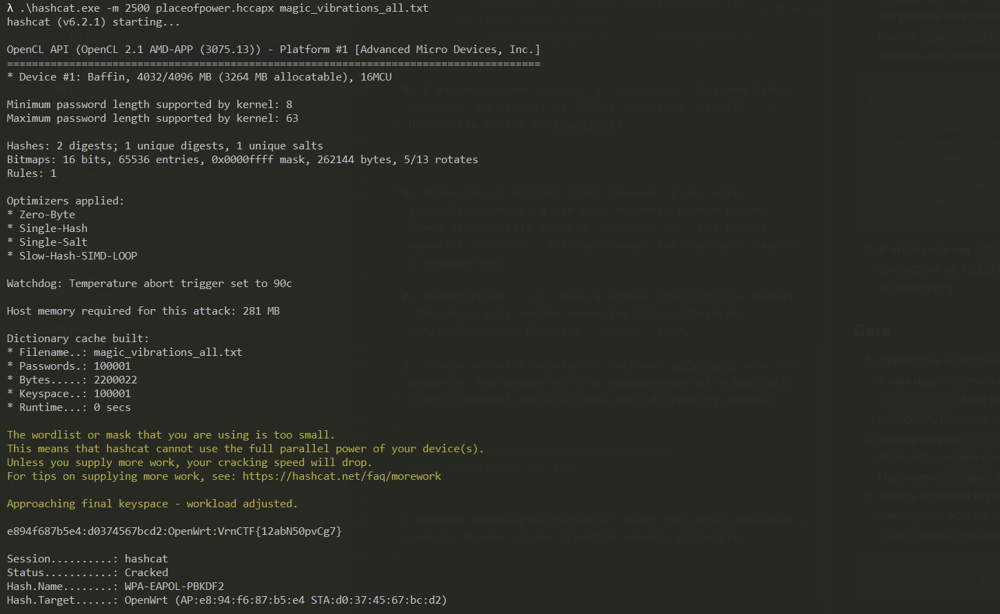

# Place Of Power

Эта задача состоит из двух этапов. 

### Вебчик

1. Для начала просто перейдем по ссылке. Нас встречает изображение роутера. Скан сайта ничего не даст, есть только главная страница. Посмотрим, что же есть в ее коде. А есть там комментарий от Йеннифэр:

```
Геральт, это древнее заклинание позволит тебе перехватить
отпечаток магической силы колдуна, дальше думай сам.
Где-то должен находиться список всех магических паролей,
которые надо будет перебрать. Попробуй поискать на разных планах
и подуровнях астрала. Я уверена, что он будет называться
magic_vibrations_all.txt или что-то типа того.
```

2. Смотрим дальше. После комментария и находится "древнее заклинание". Скрипт отправляет запросы на `/astral/plane12/sublevel7/placeofpower.cap` каждые 10 секунд. Становится понятно о каких "планах" и "подуровнях" говорила Йеннифэр. Это цифры в адресе строки. Но об этом позже, теперь перейдем по ссылке.

3. Скачается файл `placeofpower.cap`. Изображение роутера на главной странице намекает нам, что это файл с хендшейком. 

4. Теперь понятно, что за магические пароли надо будет перебирать. Попробуем подставлять разные числа на планы и подуровни в ссылке `/astral/plane?/sublevel?/magic_vibrations_all.txt`. Можно сделать это скриптом:

```python
import requests

for plane in range(1, 10):
    for sublevel in range(1, 10):
        r = requests.get("http://localhost:3000/astral/plane" + str(plane) + "/sublevel" + str(
            sublevel) + "/magic_vibrations_all.txt")
        if len(r.text) > 1000:
            print(str(plane) + " " + str(sublevel))
```

5. В итоге получим `plane6` и `sublevel3`. Скачаем файл с паролями. Он состоит из 100000 слов вида `VrnCTF{...}`. Перебирать руками не советую :)

### Сети

1. Переходим ко второму этапу решения. У нас есть хендшейк, словарь, а нам надо получить верный пароль. Можно использовать утилиту `aircrack-ng`. Мне больше нравится `hashcat`, поэтому покажу, как подобрать пароль с помощью него

2. Конвертируем `.cap` файл в нужный для hashcat-a формат. Для этого есть онлайн конвертер https://hashcat.net/cap2hccapx/. Получаем `.hccapx` файл.

3. Теперь остается перебрать. Несложно нагуглить, как это делается. Инструкция есть на официальном сайте hashcat-a https://hashcat.net/wiki/doku.php?id=cracking_wpawpa2. 

```
hashcat.exe -m 2500 placeofpower.hccapx magic_vibrations_all.txt
```

С хорошей видеокартой результат будет уже через несколько секунд. В ином случае придется немного подождать.



Но в любом случае получаем верный флаг: `VrnCTF{12abN50pvCg7}`